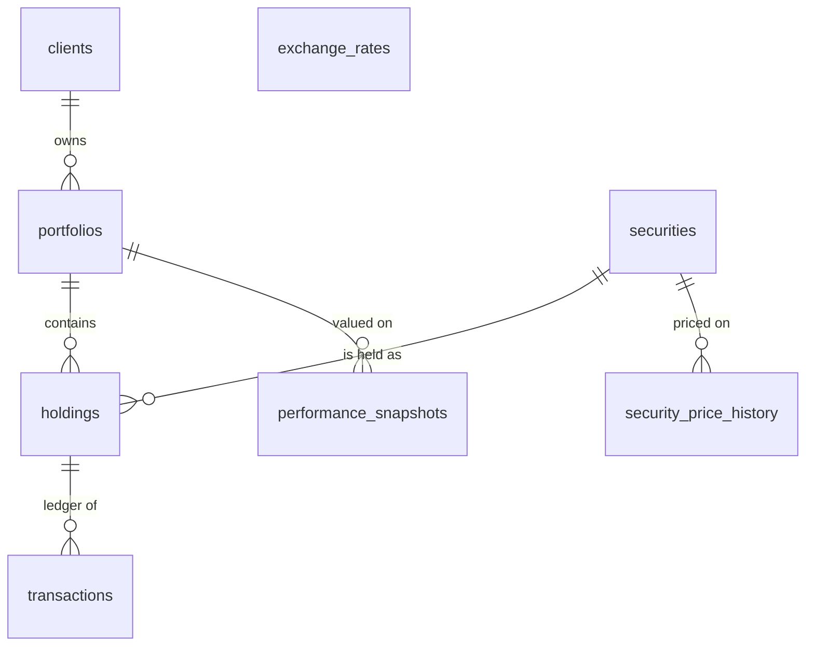

# Architecture

How the portfolio dashboard backend is organised, how a request flows through it, how it talks to the database and the external CRM, and how to extend it.

**Stack:** Python 3.12 · FastAPI · SQLAlchemy 2.0 on SQLite · httpx (CRM client) · Pydantic (response models) · pytest + mypy.

---

## 1. The big picture

A layered service. Each layer has one job and only calls the layer below it.

```
 HTTP request
     │
 ┌───▼──────────────┐  app/routers/    Which URL, which inputs, which response model. No logic.
 │  Routers         │
 └───┬──────────────┘
 ┌───▼──────────────┐  app/services/   One use case each: validate input, check the portfolio
 │  Services        │                  exists, fetch data, run calculations, shape the response.
 └──┬─────────┬─────┘
    │         │
 ┌──▼─────┐ ┌─▼────────────────────────┐ ┌──────────────────────────┐
 │ domain │ │ db/ + models/            │ │ services/crm_client.py   │
 │ pure   │ │ SQLite through SQLAlchemy│ │ + crm_mapper.py          │
 │ maths  │ │ (engine → session →      │ │ external CRM over HTTP,  │
 │ no I/O │ │  repositories → models)  │ │ with a hard time limit   │
 └────────┘ └──────────────────────────┘ └──────────────────────────┘

 Cross-cutting: main.py (wiring) · config.py · clock.py · errors.py · schemas.py
```

**Layer rules**
- Routers never touch the database or the CRM; they call a service.
- Services never write queries; they call repository functions.
- `app/db/repositories.py` is the **only** place queries live.
- `app/domain/` never does I/O (no database, network, files, or clock), so it is tested directly with plain values.
- Errors are turned into HTTP responses in **one** place (`app/errors.py`).

---

## 2. What happens during a request

`GET /portfolios/P-9001/holdings`:

1. **Router** (`routers/holdings.py`) matches the URL and calls `HoldingsService.list_holdings("P-9001")`.
2. **Service** (`services/holdings.py`) opens a short-lived database **session**.
3. **Repository** (`db/repositories.py`):
   - `portfolio_exists()`: if false, the service raises a 404.
   - `list_positions()`: one SQLAlchemy query joining `Holding` to `Security`, returning plain `Position` objects.
4. The session closes (connection returned to the pool).
5. **Domain** (`domain/holdings.py`) computes market value, weight, gain/loss and day change using exact `Decimal` arithmetic; results are unrounded.
6. **Service** rounds for output (`domain/rounding.py`) and builds `schemas.Holding` objects.
7. **FastAPI** validates them against the response model and serialises camelCase JSON. Any error raised along the way is converted by `errors.py` into `{ "error", "message" }`.

`GET /portfolios/P-9001` (metadata) has the same shape, but its data source is the external CRM:
`services/portfolio_metadata.py` → `crm_client.get_portfolio()` (HTTP, 2 s total limit) → `crm_mapper.map_crm_portfolio()` (legacy format → clean schema) → CRM failures mapped to 404 / 502 / 504.

`GET /portfolios/P-9001/performance-history?range=YTD`: the service validates `range` (400 if invalid), checks the portfolio exists (404), computes the start date with `domain/history.py`, and the repository returns snapshots between that date and today.

---

## 3. Files and what they do

### App wiring and cross-cutting (`app/`)
| File | Responsibility |
|---|---|
| `__main__.py` | `python -m app`: starts uvicorn with the app factory. |
| `main.py` | **`create_app()`**: the composition root. Builds the database engine and session factory, CRM client and services; registers error handlers and routers; closes resources on shutdown. Every dependency can be passed in, which is how tests inject an in-memory database, a fixed clock, or a different CRM. |
| `config.py` | `Settings` loaded and validated from environment variables, with local-development defaults. |
| `clock.py` | Injectable "today" (UTC) so date-relative logic is testable. |
| `errors.py` | `ApiError` plus handlers that give **every** error the same `{error, message}` body, including framework errors (unknown route 404, wrong method 405, invalid input **400** instead of FastAPI's 422, unexpected 500 without stack traces). |
| `schemas.py` | Pydantic **response models** (`PortfolioMetadata`, `Holding`, `PerformancePoint`). snake_case in Python, camelCase in JSON. They validate outgoing data and generate the Swagger docs. |

### Routers: the HTTP edge (`app/routers/`)
One file per feature, so parallel work rarely touches the same file.

| File | Endpoint |
|---|---|
| `portfolios.py` | `GET /portfolios/{portfolio_id}`: portfolio metadata from the CRM |
| `holdings.py` | `GET /portfolios/{portfolio_id}/holdings` |
| `history.py` | `GET /portfolios/{portfolio_id}/performance-history?range=` |

### Services: use cases and integrations (`app/services/`)
| File | Responsibility |
|---|---|
| `portfolio_metadata.py` | Fetch from CRM → map → translate CRM failures into API errors. |
| `crm_client.py` | HTTP client for the CRM: one shared connection pool, a hard **total** time limit (covers connect, headers and body), failures classified as `not_found` / `timeout` / `unavailable` / `bad_response`. |
| `crm_mapper.py` | **Anti-corruption layer**: converts the CRM's legacy payload into our schema. Selects the account by `acct_ref` (never by position), reads both nesting layouts, turns missing/invalid values into `null` (never an invented 0). |
| `holdings.py` | Holdings use case: existence check, load positions, value them, round for output. |
| `history.py` | History use case: validate range, existence check, load snapshots for the date window. |

### Domain: pure business logic (`app/domain/`)
| File | Responsibility |
|---|---|
| `holdings.py` | Valuation maths with exact `Decimal` arithmetic; previous close 0 → `null` percentage; never returns `-0`. |
| `history.py` | Range rules (`1D`, `1M`, `YTD`, `1Y`, `All`), month-end and leap-year clamping, strict validation. |
| `rounding.py` | Output rounding: money 2 dp half-up, ratios 6 dp. |

### Models: the data structure (`app/models/`)
One SQLAlchemy class per table: typed columns, constraints and navigable relationships.

| File | Class → table |
|---|---|
| `base.py` | `Base`: shared metadata and constraint-naming rules |
| `client.py` | `Client` → `clients` |
| `portfolio.py` | `Portfolio` → `portfolios` |
| `security.py` | `Security` → `securities`, `PricePoint` → `security_price_history` |
| `holding.py` | `Holding` → `holdings` |
| `transaction.py` | `Transaction` → `transactions` (`TransactionType` = BUY/SELL) |
| `performance.py` | `PerformanceSnapshot` → `performance_snapshots` |
| `exchange_rate.py` | `ExchangeRate` → `exchange_rates` |
| `__init__.py` | Registers all models; single import point (`from app.models import Portfolio`) |

### Database access (`app/db/`)
| File | Responsibility |
|---|---|
| `engine.py` | Creates the **engine**: the single gateway to SQLite. Turns foreign keys on for every connection. In-memory databases share one connection so every session sees the same data. |
| `session.py` | The **session factory**. A session is one unit of work; services open one per call and it closes automatically. |
| `repositories.py` | **All queries.** SQLAlchemy selects that take a session and return plain domain objects (`Position`, `Snapshot`). |
| `database.py` | `build_database()`: delete the old file, create every table **from the models**, seed in one transaction. Also renders `schema.sql`. |
| `seed.py` | Loads `seed.json` and the history file as model objects; fails loudly on inconsistent fixtures (`SeedError`). |
| `history_fixture.py` | Re-runs the supplied history generator at startup if the sample file is missing or stale. |
| `schema.sql` / `schema_dump.py` | Generated, human-readable copy of the schema and the command that regenerates it (`python -m app.db.schema_dump`). A test fails if it is out of date. |

### Tests (`tests/`)
| Path | What it proves |
|---|---|
| `conftest.py` | Shared fixtures: fresh in-memory database per test, raw connection for SQL-based test setup, pinned "today", and the real mock CRM started as a subprocess on a random port. |
| `unit/test_holdings_calc.py`, `test_history_range.py` | Calculations and date rules with hand-worked expected values. |
| `unit/test_crm_mapper.py`, `test_crm_client.py`, `test_portfolio_metadata_service.py` | CRM mapping, client failure classification and timeouts, service error translation. Explained case by case in [`tests/TASK1_TESTS.md`](../tests/TASK1_TESTS.md). |
| `unit/test_models.py`, `test_database.py`, `test_history_fixture.py` | Schema matches models, relationships navigate, constraints reject bad rows, seeding, history refresh. |
| `http/test_*.py` | Every endpoint end to end, including CRM modes (ok, error, timeout, missing, nested) against the real mock. |

Run everything: `python -m pytest && python -m mypy` (190 tests; mypy checks all of `app/`).

---

## 4. Data model



- **Relationships as objects:** `client.portfolios`, `portfolio.holdings`, `holding.security`, `holding.transactions`, `security.price_history`, `portfolio.snapshots`, all navigable in both directions.
- **Rules enforced by the database itself:** foreign keys; non-negative prices, quantities and market values; 3-letter currency codes; `BUY`/`SELL` only; positive transaction quantities; one position per security per portfolio.
- **Security master:** price belongs to the security, not the holding. AAPL is held in two portfolios but stored once.
- **Snapshot columns:** `holdings.quantity` and `holdings.cost_basis_per_share` are stored from the seed. The `transactions` table and `Holding.transactions` relationship are in place for a future ledger-replay feature to derive them instead.
- **Source of truth:** the models. `schema.sql` is generated from them.

---

## 5. How we talk to the database

```
startup:      engine.py  create_db_engine()  ──▶  database.py build_database()
                                                   1. delete old file
                                                   2. Base.metadata.create_all()  (tables from models)
                                                   3. seed.py, in one transaction
per request:  service ──opens──▶ Session ──used by──▶ repositories.py ──queries──▶ models / SQLite
                       └────────── closed automatically at the end of the call ──────────┘
```

- **Engine:** one per app; owns the connection pool; foreign keys enabled on every connection.
- **Session:** one short-lived unit of work per service call.
- **Repositories:** SQLAlchemy queries, always parameterised (no SQL injection), returning plain objects so services and calculations never depend on the ORM.
- **Lifecycle:** `data/app.db` (gitignored) is a disposable copy of the fixtures, **rebuilt on every start**, so every run and every test begins from the same known state. Tests use `:memory:`.

---

## 6. External CRM integration

- `crm_client.py` uses one shared `httpx.AsyncClient`, created on first use and closed at shutdown.
- `asyncio.timeout` caps the **whole** call (default 2 s, `CRM_TIMEOUT_MS`); httpx's own timeouts only cover individual network steps.
- Failure mapping:

  | CRM outcome | Our response |
  |---|---|
  | 404, or account missing from payload | `404 portfolio_not_found` |
  | 5xx or network error | `502 crm_unavailable` |
  | Time limit exceeded, or CRM 504/408 | `504 crm_timeout` |
  | Structurally unusable payload | `502 bad_crm_response` |

- **Isolation:** holdings and history read only from our database, so they keep working while the CRM is down (covered by a test).

---

## 7. Errors, configuration and conventions

- **One error shape** everywhere: `{ "error": "<code>", "message": "<text>" }`. Codes in use: `portfolio_not_found`, `invalid_range`, `crm_unavailable`, `crm_timeout`, `bad_crm_response`, `bad_request`, `not_found`, `method_not_allowed`, `internal_error`.
- **Configuration** comes from environment variables (`PORT`, `HOST`, `CRM_BASE_URL`, `CRM_TIMEOUT_MS`, `DATABASE_PATH`, `SEED_PATH`, `HISTORY_PATH`), validated at startup.
- **JSON** is camelCase; percentages are decimals; money is CAD in the seed data; undefined values are `null`, never an invented `0`.

---

## 8. Security posture

**In place**
- Parameterised queries only (no SQL injection).
- Response validation through Pydantic models; strict input validation where inputs exist (`range`).
- Hard time limit on outbound CRM calls, so a slow upstream cannot hang requests.
- No stack traces or internal details in error responses.
- Database-backed endpoints isolated from CRM failures.
- Pinned dependencies; no secrets in the repository; the database file and generated fixtures are gitignored.

**Not implemented (next steps)**
- **Authentication:** a bearer-token check as a single FastAPI dependency applied to every router, so new endpoints are protected by default.
- CORS allow-list, security headers, rate limiting, request logging with request IDs.
- Per-client authorization (which user may see which portfolio) and real user management.
- HTTPS is expected to be terminated by a proxy in front of the service.

---

## 9. Key decisions

| Decision | Why |
|---|---|
| Layered architecture with a composition root (`create_app`) | Each concern has one home; dependencies are injectable, so tests swap the database, clock and CRM without patching. |
| SQLAlchemy 2.0 models | Typed relational objects, one source of truth for the schema, constraints enforced in the database, and a move to Postgres is a connection-string change. |
| Repositories return plain domain objects | Calculations and services stay independent of the ORM and are trivially unit-testable. |
| Rebuild the database from fixtures on every start | Deterministic demos and tests. No migrations needed while data is seeded; add Alembic once data must persist across schema changes (constraint names are already predictable for it). |
| Holdings and history read from our database, not the CRM | Resilience: the unreliable upstream only affects the endpoint that needs it. |
| CRM behind a client plus a mapper | The upstream's unreliability and legacy format are contained in two files. |
| Exact decimal arithmetic, rounding only on output | No half-cent errors; weights are not forced to sum to 100%. |
| `null` for undefined values | Clients can tell "unknown" from "zero". |
| One error envelope; 400 instead of 422 | Consistent, predictable client handling, as the requirements ask. |
| Synchronous SQLAlchemy | SQLite gains nothing from an async driver; simpler code. |

---

## 10. Known limitations

- Services raise `ApiError` (which carries an HTTP status). A cleaner split would have services raise business errors (`NotFound`, `UpstreamUnavailable`) and map them to HTTP in `errors.py` only.
- The database routes are `async def` but perform short synchronous SQLite reads, which briefly block the event loop. Fine at this scale; declaring them `def` would move them to FastAPI's thread pool.
- Money is stored as SQLite `REAL`; calculations convert to `Decimal`, but storage is not exact-decimal end to end.
- No authentication yet (see section 8).

---

## 11. How to add a new endpoint

1. **Model** (if new data): add or extend a class in `app/models/`, then run `python -m app.db.schema_dump`.
2. **Seed** (if fixture-backed): load it in `app/db/seed.py`.
3. **Query:** add a function to `app/db/repositories.py` that takes a `Session` and returns plain objects.
4. **Logic:** put any calculation in `app/domain/` as a pure function, with unit tests.
5. **Use case:** add a service in `app/services/` that opens a session, calls the repository and domain code, and raises `ApiError` for expected failures.
6. **Response model:** add a Pydantic class to `app/schemas.py`.
7. **Route:** add a new file in `app/routers/` and register it in `create_app()` (`app/main.py`).
8. **Tests:** unit tests for the domain logic, HTTP tests in `tests/http/` using the `app_client` fixture.
9. **Docs:** add a section or file in `docs/`.
10. **Check:** `python -m pytest && python -m mypy`.
